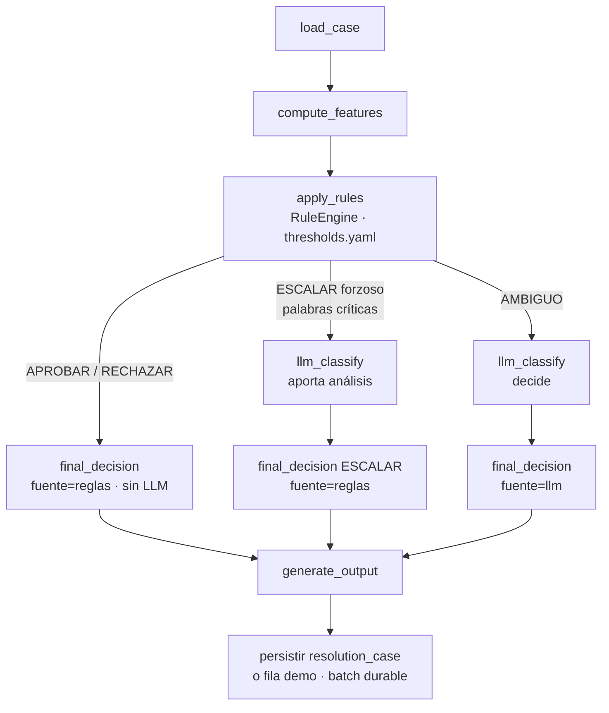

# Arquitectura

> Visión general del sistema de automatización de revisión de compensaciones.
> Leer ANTES de implementar cualquier step.

---

## Problema

Rappi Trust & Safety recibe 200+ solicitudes de compensación/día marcadas como potencialmente fraudulentas. Hoy un agente CS revisa cada caso manualmente (15-25 min/caso). El agente automatiza esa revisión emitiendo: **APROBAR**, **RECHAZAR** o **ESCALAR** (casos ambiguos → revisión humana).

## Dataset de entrada

- **Archivo:** `data/Dataset_caso_3.xlsx`
- **Pestaña:** `Caso3_Compensaciones`
- **Registros:** 150 casos
- **Columnas:** user_id, antigüedad (días), ciudad, vertical, restaurante, valor de orden, monto compensación, compensaciones en 90d, monto total compensado 90d, confirmación GPS, tiempo de entrega real, flags de fraude previos, descripción del reclamo.
- **Nota:** el campo `recomendacion_agente` viene vacío — el agente lo llena.

## Diagrama de componentes

```
                        ┌─────────────────────────────┐
                        │  Agente CS (humano)         │
                        └──────────────┬──────────────┘
                                       │ HTTP :8501
                        ┌──────────────▼──────────────┐
                         │  Streamlit UI               │  infra/ui/
                         │  - Dashboard KPIs           │
                         │  - Explorador de casos      │
                         │  - Detalle + override       │
                         │  - Políticas / Documentación│
                         └──────────────┬──────────────┘
                                        │ HTTP :8000
                         ┌──────────────▼──────────────┐
                         │  FastAPI                    │  src/api/
                         │  POST /analyze              │
                         │  POST /analyze/batch        │
                         │  GET  /cases, /stats        │
                         │  GET  /export/*              │
                         └──────────────┬──────────────┘
                                        │
                         ┌──────────────▼──────────────┐
                         │  LangGraph Pipeline         │  src/pipeline/
                         │  load_case → features       │
                         │  → rules → llm → decision   │
                         └──────────────┬──────────────┘
                                        │ SQL :5432
                         ┌──────────────▼──────────────┐
                         │  PostgreSQL 16              │  infra/db/
                         │  tabla: cases (crudo)       │
                         │  features (calculado)       │
                          │  resolution_case (resultados)│
                          │  batch_runs / batch_run_items│
                          └─────────────────────────────┘

            ┌─────────────────────────────────────────┐
            │  Testing (Playwright + pytest)           │  tests/
            │  - Unitarios (RuleEngine)                │
            │  - Integración (API + Motor genérico)    │
            │  - E2E Browser (UI Streamlit)            │
            │  - Performance                           │
            └─────────────────────────────────────────┘
```

## Flujo de decisión (LangGraph)

```
load_case
   │
compute_features      ← FeatureEngineer (src/features/)
   │
apply_rules           ← RuleEngine (src/rules/thresholds.yaml)
   │
   ├─── regla RECHAZAR dispara ──► final_decision: RECHAZAR
   │
   ├─── regla APROBAR dispara ───► final_decision: APROBAR
   │
   ├─── ESCALAR forzoso (palabras críticas) ──► final_decision: ESCALAR
   │
   └─── ninguna regla concluyente
            │
       llm_classify   ← análisis de descripcion_reclamo con LLM
             │
        final_decision ──► veredicto LLM claro → APROBAR | RECHAZAR
                           veredicto ambiguo   → ESCALAR
```

### Grafo del proceso del agente (Mermaid)

Versión renderizable del flujo de decisión (fuente de verdad en
`src/pipeline/graph.py`; se muestra en la sección "Proceso del Agente" del
Dashboard):



> Decisión discreta y determinista por jerarquía de reglas (no score continuo).
> El LLM interviene en casos ambiguos (decide APROBAR/RECHAZAR/ESCALAR) y en los
> escalados forzosos (aporta análisis, pero la decisión queda forzada a `ESCALAR`
> con `fuente='reglas'`). Su veredicto estructurado queda en
> `resolution_case.llm_resultado`.

## Reglas heurísticas (resumen — detalle en step 03)

| Regla | Condición | Decisión |
|---|---|---|
| R1 | flags_fraude_previos >= 2 | RECHAZAR |
| R2 | comp_ratio > 2.0 | RECHAZAR |
| R3 | frecuencia de reclamos > p95 | RECHAZAR |
| R4 | sin confirmación GPS + entrega demorada | RECHAZAR |
| R5 | monto compensación > p99 | RECHAZAR |
| R6 | flags=0 + comp_ratio < 0.8 + GPS ok + < 2 reclamos | APROBAR |
| R7 | GPS ok + entrega no demorada + comp_ratio < 1.0 + antigüedad > 90d | APROBAR |
| — | resto | ESCALAR (con LLM para texto) |

## Configuración del modelo LLM

Los parámetros del LLM de decisión (cliente de `llm_classify`) viven en
`src/config/model.yaml` (fuente de verdad, no secretos) con override por env
var (12-factor): `MODEL_FRAUD`, `LLM_BASE_URL`, `LLM_TEMPERATURE`,
`LLM_MAX_TOKENS`, `LLM_MAX_RETRIES`, `LLM_TIMEOUT_SECONDS`,
`LLM_MAX_CONCURRENCIA`, `LLM_INTENTOS_PARSING`, `BATCH_MAX_CONCURRENCIA`,
`LLM_CIRCUIT_UMBRAL`, `LLM_CIRCUIT_VENTANA_S`, `CASO_TIMEOUT_S`,
`JOBS_MAX_TIMEOUT_S`, `LLM_PROMPT_FILE`, `LLM_EXAMPLES_FILE`. La API key se
inyecta desde `.env` (`OPENROUTER_API_KEY`), nunca en el YAML.

- Carga tipada y validada con pydantic: `src/config/settings.py` →
  `get_llm_config()` (singleton cacheado) y `load_llm_config(path)`.
- Prompts editables sin código: `src/config/prompts/llm_system.txt` (instrucciones
  + señales canónicas) y `src/config/prompts/llm_examples.md` (3 few-shot), con
  rutas configurables (`LLM_PROMPT_FILE` / `LLM_EXAMPLES_FILE`).
- Referencia de env vars: `.env.example`.

## Infraestructura Docker

| Servicio | Imagen | Puerto | Rol |
|---|---|---|---|
| `db` | postgres:16 | 5432 | Persistencia (volúmen `pgdata`) |
| `api` | python:3.12 | 8000 | FastAPI + LangGraph |
| `ui` | python:3.12 | 8501 | Streamlit |

## Escalamiento

- **200+ casos/día:** el pipeline es stateless; `/analyze/batch` procesa en lote
  y es parametrizable (`limite`, `es_sintetico`, `solo_pendientes`).
- **Batch durable en PostgreSQL (refactor):** el estado de un job YA NO vive
  en un dict en memoria (`services._jobs` + thread daemon), que se perdía al
  reiniciar el proceso. Ahora el lote se persiste en `batch_runs` (cabecera:
  estado, filtros, totales, decisiones) y `batch_run_items` (1 fila por caso
  con `estado`, `intentos`, `error`). Esto da:
  - **Retry por caso** (2 intentos): un fallo transitorio (timeout LLM) no
    tira el lote; se re-cola el item individual.
  - **`at-least-once`:** los items se reclaman con un `UPDATE ... FOR UPDATE
    SKIP LOCKED` → no se procesa el mismo caso dos veces si corren varios
    workers.
  - **Recuperación:** al arrancar la API, `recuperar_runs_huerfanos()` revierte
    a `error` los runs `running` y deja los items re-ejecutables. Un reinicio
    no pierde el lote.
  - **Auditoría:** `resolution_case.batch_run_id` apunta al lote que generó
    cada análisis.
  - **Modo demo:** las filas del Excel se cuentan en `batch_run_items.fila_demo`
    sin escribir en `resolution_case`.
  La API y el CLI (`scripts/run_batch.py`) comparten el MISMO worker
  (`src/batch/worker.py`); `persistir_resolucion` es la fuente única del
  `INSERT ... ON CONFLICT` (antes duplicado en 3 sitios). El entrypoint unifica
  los antiguos `batch_process.py` / `batch_chunk.py`.
- **Datos sintéticos:** 100 casos generados por muestreo empírico + jitter
  gaussiano y descripciones con LLM (notebook `05_synthetic.ipynb`), validados con
  KS-test y chi-cuadrado, marcados con `es_sintetico=TRUE`.
- **Reglas (thresholds.yaml):** el flujo del agente aplica las reglas desde
  `src/rules/thresholds.yaml` vía `RuleEngine` (sin base de datos). Los resultados
  por caso se consolidan en `resolution_case` con el contrato separado por origen:
  `decision_regla` (APROBAR/RECHAZAR/AMBIGUO/ESCALAR), `decision_llm` (veredicto
  discreto), `justificacion_regla`/`justificacion_llm` y `senales_regla`/`senales_llm`
  (las señales de reglas salen de `RuleEngine`), más el análisis LLM crudo en
  `llm_resultado` JSONB.

## Robustez: fallbacks y guardrails

El agente degrada con criterio en vez de romper o asignar decisiones erróneas:

- **Degradación de reglas (nunca crash):** si `apply_rules` fallara por cualquier
  causa (p. ej. archivo YAML ausente), degrada a `AMBIGUO` (el grafo lo deriva al
  LLM) y registra el motivo en `fallback_info`, en vez de propagar la excepción.
  Si el LLM también falla, `final_decision` queda en `ESCALAR` (revisión manual).
- **Circuit breaker del proveedor LLM** (`src/pipeline/nodes/llm_circuit.py`):
  cuando el proveedor (OpenRouter) falla repetidamente en una ventana corta
  (`llm_circuit_umbral`, `llm_circuit_ventana_s`), el fusible se abre y los casos
  ambiguos derivan directo a `ESCALAR circuit_open` sin volver a llamar (evita
  flood de llamadas y de crédito). Half-open: tras la ventana se reintenta 1 vez.
- **Timeouts** (`src/batch/worker.py`):
  - **Por caso** (`caso_timeout_s`): cada `graph.ainvoke` se acota con
    `asyncio.wait_for` → un caso colgado no congela el batch.
  - **Por job (dinámico):** `ceil(total / batch_concurrencia) × caso_timeout_s`
    + margen, tope `jobs_max_timeout_s`. Escala con el volumen (un batch de
    +250 casos no se corta por un límite arbitrario); ante exceso, el run queda
    `error` y la UI lo informa.
- **Guardrail anti inyección de prompt** (`llm_system.txt`): el texto del reclamo
  y el contexto se tratan como **datos, no instrucciones**; se ignoran
  instrucciones embebidas y no se revela el prompt.
- **Telemetría de fallbacks:** columna `resolution_case.fallback` persiste el
  motivo de degradación (`reglas_yaml`, `llm_circuit_open`, `llm_provider_error`,
  `llm_parsing`, ...). Se muestra como badge en el detalle del caso y como
  columna del Excel exportado.
