# Reporte de Análisis Exploratorio (EDA) — Caso 3

> Análisis exploratorio sobre el dataset `Caso3_Compensaciones` (150 casos
> originales). Fuente: `notebooks/01_eda.ipynb`. Este reporte consolida los
> hallazgos que alimentaron el *feature engineering* (step 02) y las **reglas
> heurísticas** de fraude (step 03).

**Objetivo:** entender distribuciones, outliers, correlaciones y patrones de
negocio. No se entrena modelo ML: el dataset es pequeño (150 casos) y la decisión
se basa en reglas documentadas + análisis LLM para el texto libre.

---

## 1. Vista general

- **150 casos × 16 columnas, sin nulos**: no se requiere imputación.
- `recomendacion_agente` viene en `PENDIENTE` en todos los casos — es la columna
  que el agente debe inferir (ver `docs/diccionario_datos.md` — el agente entrega
  la recomendación en el output derivado, no en el Excel fuente).
- `descripcion_reclamo` es texto libre → candidato a análisis LLM en el pipeline.
- `entrega_confirmada_gps` es categórica con **4 estados** (no binaria).

---

## 2. Estadísticos descriptivos y percentiles clave

| Campo | p50 | p90 | p95 | p99 | Máx |
|---|---|---|---|---|---|
| `compensacion_solicitada_mxn` | 237 | — | ~528 | ~605 | 693 |
| `num_compensaciones_90d` | 3 | — | **10** | — | 14 |
| `tiempo_entrega_real_min` | 59 | **96** | — | — | 110 |
| `monto_compensado_90d_mxn` | — | — | ~2,499 | — | 2,764 |
| `comp_ratio` | ~0.76 | — | 0.96 | 0.99 | 1.05 |

**Lectura:**
- Compensaciones por encima de ~600 MXN son raras (candidatas a revisión).
- Más de **10 reclamos en 90 días** es atípico.
- Entregas > **96 min** (p90) son las más lentas.
- Usuarios que ya acumularon `monto_compensado_90d` alto son de riesgo acumulado.

---

## 3. Distribuciones y outliers

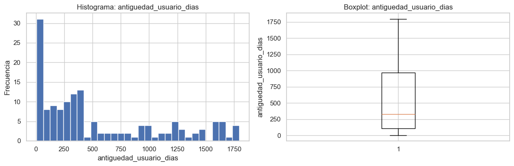
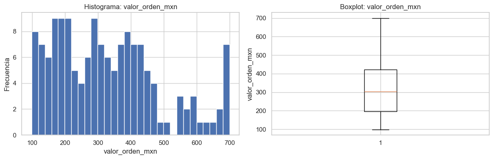
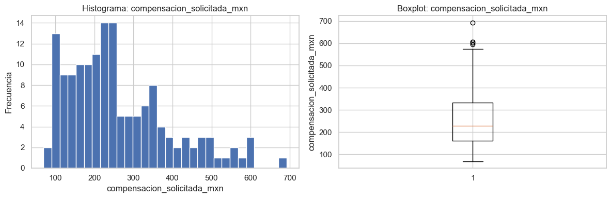
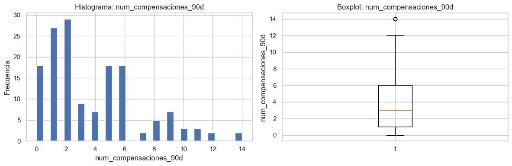
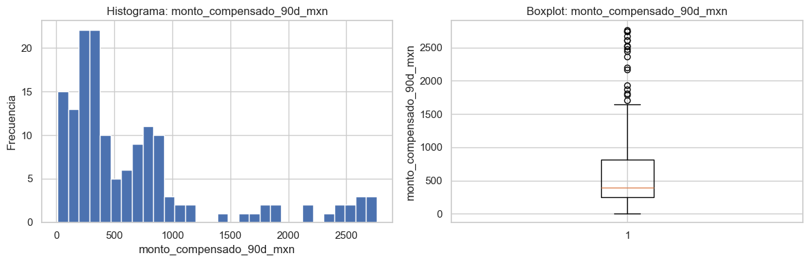
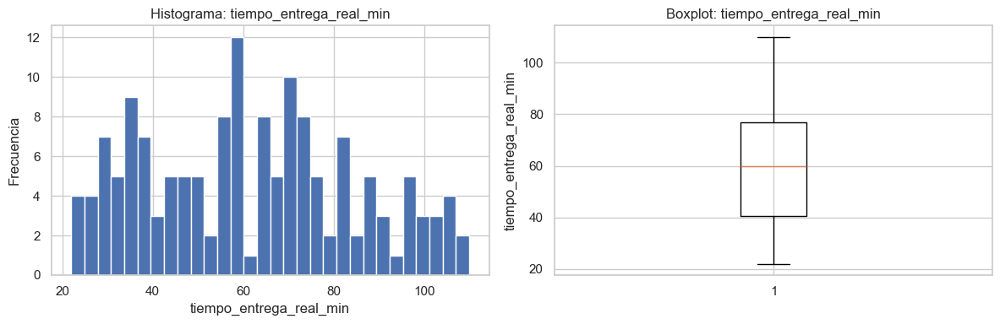
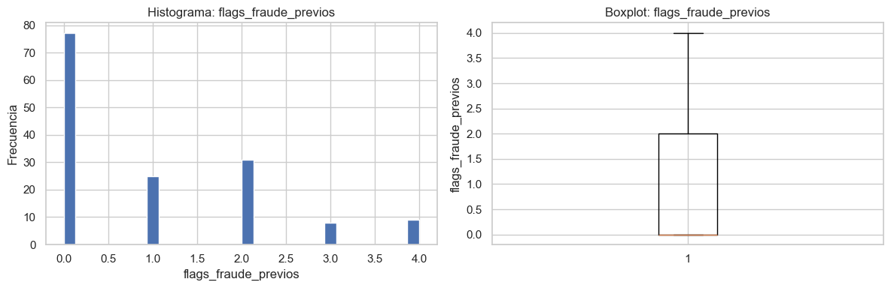

- **`monto_compensado_90d_mxn`:** **18 outliers** (> 1,650 MXN) → sub-población que
  acumula compensaciones muy por encima del resto — señal fuerte de abuso recurrente.
- **`compensacion_solicitada_mxn`:** solo 4 outliers (> 589 MXN): los montos
  extremos individuales son raros, pero existen.
- **`num_compensaciones_90d`:** 2 outliers (> 13.5): reclamar más de 13 veces en
  90 días es excepcional.

---

## 4. Correlaciones

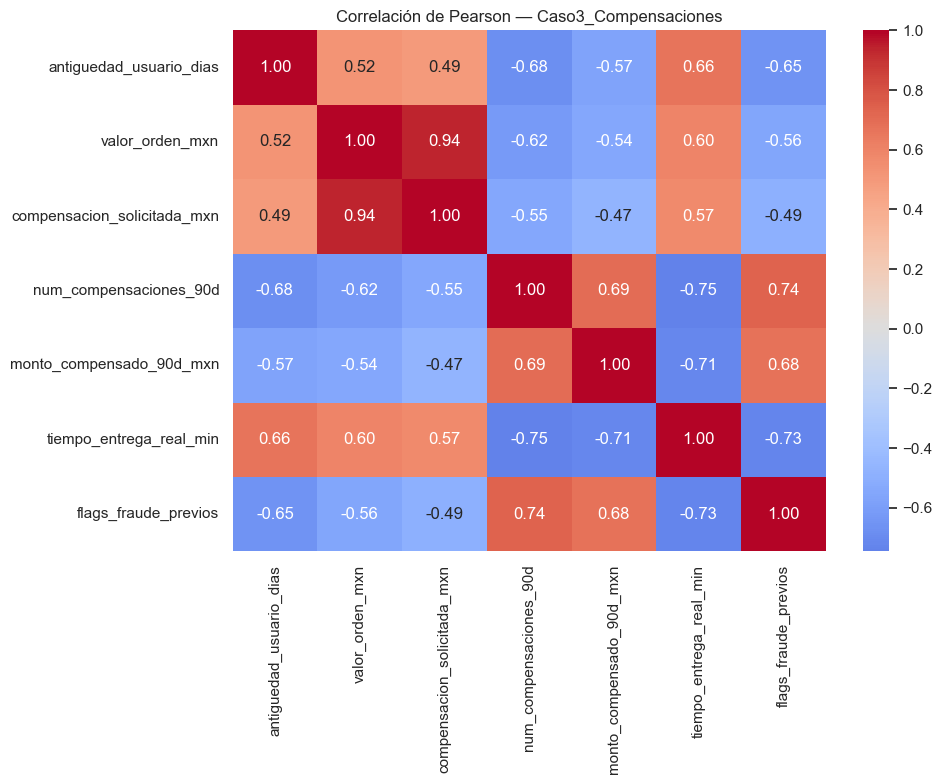

- **`valor_orden_mxn` vs `compensacion_solicitada_mxn`: r = 0.94.** Relación casi
  lineal (pides compensación proporcional a tu orden). **Implicación:** el ratio
  compensación/orden (`comp_ratio`) es la señal clave; quien se desvía de esa
  proporción es atípico.
- **`num_compensaciones_90d` vs `flags_fraude_previos`: r = 0.74.** La frecuencia
  de reclamos se asocia con flags de fraude: valida la frecuencia como señal.
- **Correlaciones negativas** de `tiempo_entrega_real_min` con reclamos y flags:
  quien más reclama reporta entregas más rápidas (patrón contraintuitivo, posible
  indicador de reclamos oportunistas).

---

## 5. Patrones de negocio

### 5.1 Geografía y vertical

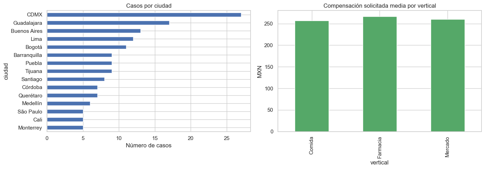

- **Comida** concentra 79 de 150 casos (53%) — esperable (vertical con más volumen).
- Las compensaciones medias son similares entre verticales (~257–267 MXN):
  ninguna vertical reclama sistemáticamente más → no requiere threshold propio.

### 5.2 Restaurantes con más reclamos

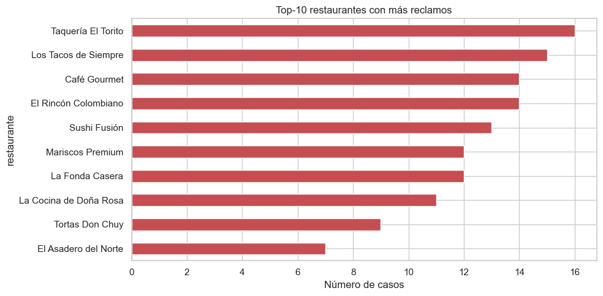

- Los 10 restaurantes con más reclamos suman ~123 de 150 casos. La concentración
  es alta pero el dataset es pequeño: el riesgo por restaurante se usa como
  feature **agregada suave**, no como regla dura.

### 5.3 Antigüedad del usuario — insight fuerte

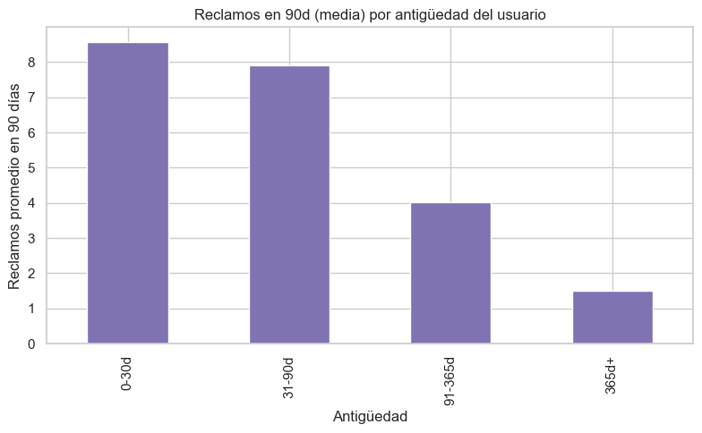

- **Usuarios de 0–30 días: media de 8.6 reclamos/90d y 2.8 flags de fraude.**
- **Usuarios de 365+ días: media de 1.5 reclamos/90d y 0.2 flags.**

La antigüedad es el **predictor más claro** del dataset: a menor antigüedad, mayor
frecuencia de reclamos y más flags previos. Debe ponderar fuerte en las reglas
(cristalizó en `flag_account_abuse` / `antiguedad_min` de `thresholds.yaml`).

### 5.4 GPS vs frecuencia de reclamos — la paradoja

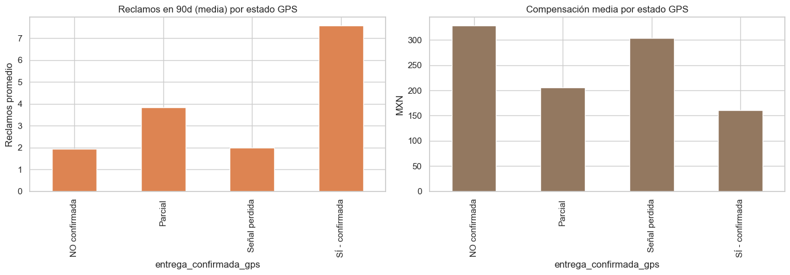

- GPS **no confirmada** → compensaciones **altas** (~328 MXN) pero pocos reclamos
  y pocos flags.
- GPS **confirmada** → compensaciones **bajas** (~161 MXN) pero concentran la mayor
  frecuencia de reclamos (7.6) y flags (2.3).

**Conclusión:** el GPS por sí solo **no decide**. El defraudador sofisticado reclama
montos pequeños y repetidos incluso con entrega confirmada. El GPS funciona como
señal **en combinación**, no aislada.

---

## 6. Conclusiones — señales candidatas para el motor de reglas

| Señal (feature) | Evidencia del EDA |
|---|---|
| `comp_ratio` = compensación / valor_orden | r = 0.94 entre ambas; desviarse es atípico |
| `antiguedad_usuario_dias` (baja) | 0–30d: 8.6 reclamos y 2.8 flags de media |
| `num_compensaciones_90d` | p95 = 10; correlación 0.74 con flags |
| `monto_compensado_90d_mxn` | 18 outliers > 1,650 MXN |
| `flags_fraude_previos` | Predictor directo validado |
| `gps_match_ok` + monto alto | Paradoja GPS: no decide solo |
| `tiempo_entrega_real_min` | p90 = 96 min; correlación negativa con reclamos |
| `riesgo_restaurante` (agregado) | Concentración alta en pocos restaurantes |
| `descripcion_reclamo` (texto) | Texto libre → análisis LLM en el pipeline |

**Decisión de diseño:** con 150 casos no se entrena un modelo ML. El motor es de
**reglas heurísticas** con thresholds derivados de los percentiles del EDA,
centralizados en `src/rules/thresholds.yaml`, más análisis LLM del texto libre para
los casos que las reglas no resuelven → **ESCALAR**.

> Los umbrales finales del motor refinaron estos candidatos del EDA: ver
> `docs/politicas_decision.md` (criterios y valores) y `docs/diccionario_datos.md`.
> P. ej. `comp_ratio` se recorta en `RECHAZAR > 0.99` (p99), no en el candidato
> inicial 2.0.